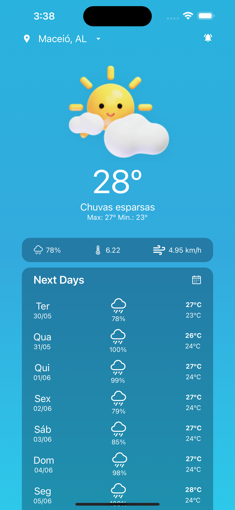

# Processo seletivo para desenvolvedor mobile (NEES)

Este repositório se trata de um projeto para um processo seletivo, o qual pedia para desenvolver um aplicativo em React Native, se baseando no protótipo: 

Esta tela pode ser encontrada neste [Figma Community](https://www.figma.com/community/file/1158928016905524023) criado pela [@becabelin](https://www.figma.com/@becabelin). Claro que uma ou outra coisa pode ser adaptada, mas essa adaptação depois poderá ser questionada na entrevista.

### Observações

A api fornecida possui um limite de requisições diárias por IP e acabei esgotando a minha, por isso, criei um mock no arquivo "weather.json" para rodar a aplicação.

# Resultados ✨

